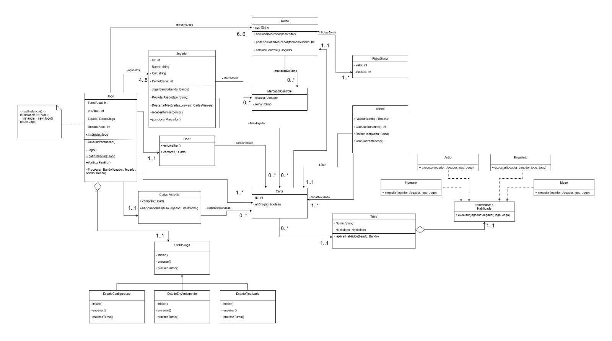
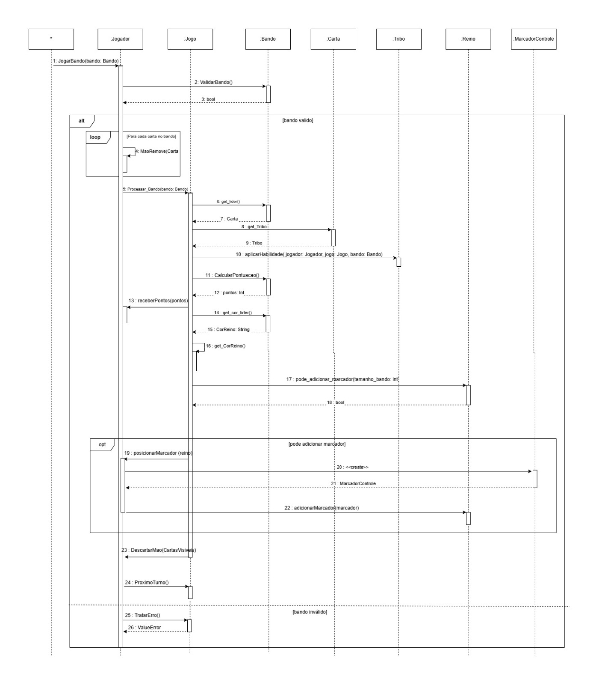

# Modelagem UML — Sistema de Jogo

Projeto acadêmico desenvolvido na Universidade Federal Fluminense (UFF),
com foco na análise e modelagem de um sistema utilizando UML.

## Diagramas

### Diagrama de Classes

Representação da estrutura do sistema, incluindo classes,
atributos, métodos e relacionamentos.

### Diagrama de Sequência

Representação da sequência de interações entre os objetos
durante a execução de uma funcionalidade do sistema.

### Diagrama de Comunicação

Representação da comunicação e das mensagens trocadas
entre os objetos do sistema.

## Conceitos utilizados

- UML
- Orientação a Objetos
- Modelagem de Sistemas
- Diagrama de Classes
- Diagrama de Sequência
- Diagrama de Comunicação

## Contexto

Projeto desenvolvido para fins acadêmicos na graduação
em Sistemas de Informação da Universidade Federal Fluminense (UFF).
